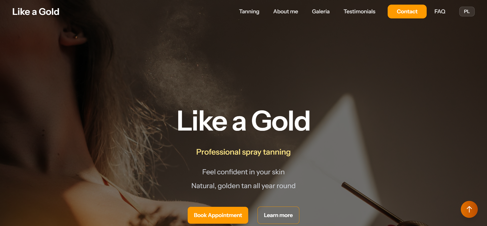
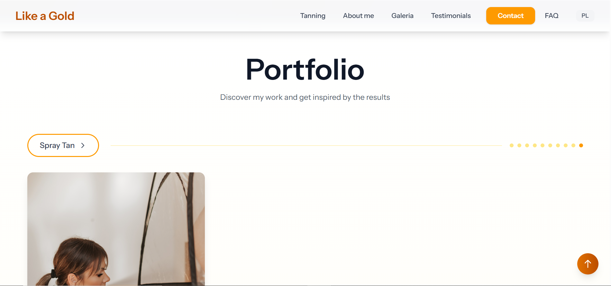
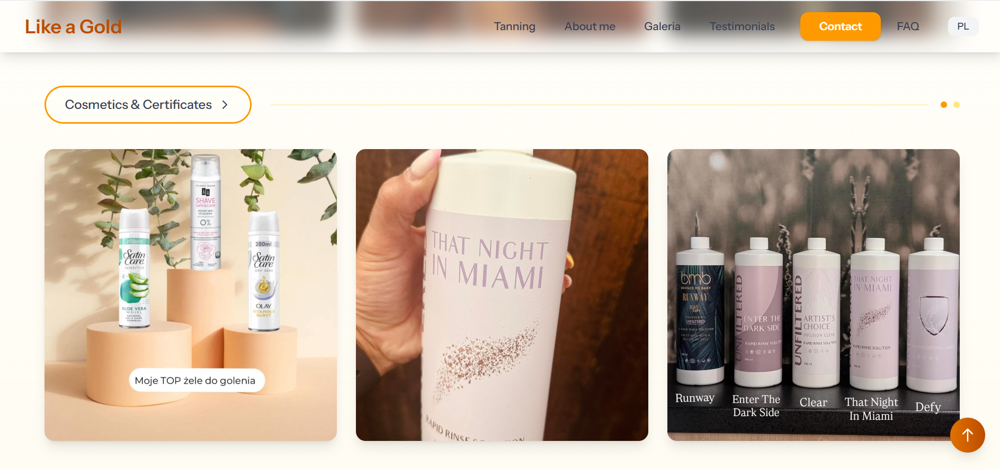
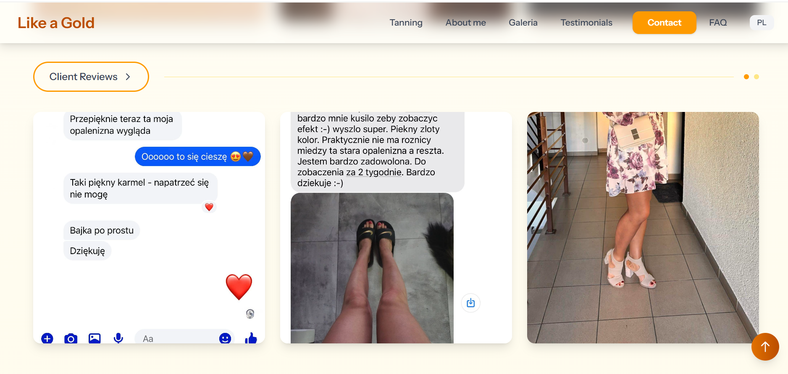
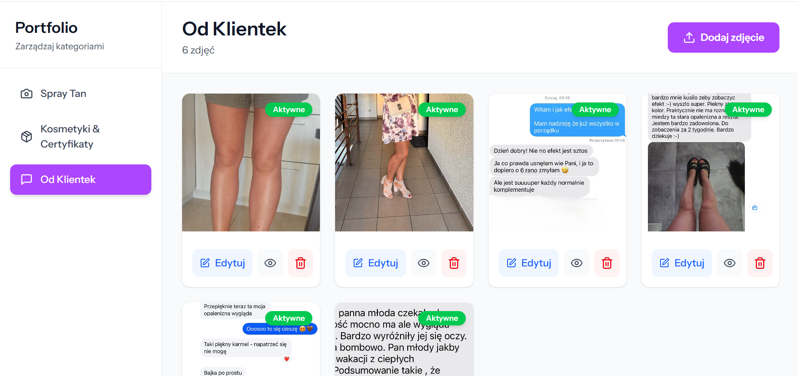

# Like a Gold - Site Web Spray Tan Professionnel

Site web vitrine avec panel d'administration pour un service de spray tan professionnel basé en Pologne.


## 📋 Table des matières

- [À propos](#à-propos)
- [Fonctionnalités](#fonctionnalités)
- [Technologies utilisées](#technologies-utilisées)
- [Architecture](#architecture)
- [Installation](#installation)
- [Configuration](#configuration)
- [Utilisation](#utilisation)
- [Sécurité](#sécurité)
- [Auteur](#auteur)

## 🎯 À propos

**Like a Gold** est un site web moderne et responsive pour un service de spray tan professionnel. Le projet combine une vitrine élégante pour les clients avec un panel d'administration complet pour gérer le contenu dynamique du portfolio.

### Objectifs du projet
- Présenter les services de spray tan de manière professionnelle
- Offrir une expérience utilisateur fluide et responsive
- Permettre une gestion autonome du portfolio d'images
- Support multilingue (Polonais/Anglais)
- Optimisation SEO et performances

## ✨ Fonctionnalités

### Front-office (Site public)

#### Composants statiques
1. **Header** - Navigation principale avec sélecteur de langue (PL/EN)
2. **Hero** - Section d'accueil avec appel à l'action
3. **Process** - Explication détaillée du processus spray tan
4. **About** - Présentation de l'experte et de son expérience
5. **Portfolio Gallery** - Galerie d'images dynamique avec filtres (composant principal)
6. **Testimonials** - Témoignages clients avec notation 5 étoiles
7. **CTA (Call-to-Action)** - Section contact avec coordonnées et liens sociaux
8. **FAQ** - Questions fréquentes sur le spray tan
9. **Footer** - Pied de page avec navigation rapide et mentions légales

#### Portfolio Gallery (Dynamique)
- **Chargement via API** : Récupération des images depuis la base de données
- **3 catégories** : Opalanie (spray tan), Kosmetyki (cosmétiques), SMS (témoignages)
- **Filtrage en temps réel** : Navigation entre les catégories
- **Carrousel automatique** : 3 images par catégorie avec navigation
- **Modal de zoom** : Visualisation en grand format
- **Responsive** : Adaptation mobile/tablette/desktop

#### Internationalisation (i18n)
- Support **Polonais** (langue par défaut)
- Support **Anglais**
- Changement de langue en temps réel
- Traductions complètes de tous les composants

#### Design & UX
- **Responsive** : Mobile-first approach
- **Animations fluides** : Transitions et hover effects
- **Thème cohérent** : Couleurs dorées/ambrées (spray tan)
- **Smooth scroll** : Navigation fluide entre sections
- **Optimisation images** : Lazy loading

### Back-office (Panel Admin)

#### Dashboard
- Vue d'ensemble du portfolio
- Statistiques des images par catégorie
- Accès rapide aux fonctionnalités CRUD

#### Gestion du Portfolio (CRUD complet)
- **Create** : Upload d'images avec preview
- **Read** : Liste avec miniatures et filtres
- **Update** : Modification des métadonnées (titre, description, catégorie)
- **Delete** : Suppression avec confirmation
- **Réorganisation** : Drag & drop pour changer l'ordre d'affichage
- **Activation/Désactivation** : Toggle de visibilité des images
- **Catégorisation** : 3 catégories (opalanie, kosmetyki, sms)

#### Authentification
- Système de connexion sécurisé (Laravel Sanctum)
- Protection CSRF
- Sessions sécurisées
- Pages de login en polonais

## 🛠 Technologies utilisées

### Front-end
- **React 18.x** - Bibliothèque JavaScript UI
- **Inertia.js** - Framework SPA avec Laravel
- **Tailwind CSS** - Framework CSS utility-first
- **i18next** - Internationalisation
- **Lucide React** - Icônes modernes
- **Headless UI** - Composants accessibles

### Back-end
- **Laravel 11.x** - Framework PHP
- **MySQL/SQLite** - Base de données
- **Laravel Sanctum** - Authentification API
- **Eloquent ORM** - Gestion de la base de données

### Outils de développement
- **Vite** - Build tool moderne
- **npm** - Gestionnaire de paquets
- **Git** - Contrôle de version
- **Composer** - Gestionnaire de dépendances PHP

## 📐 Architecture

### Structure MVC
```
Utilisateur
    ↓
React (Front-end + Inertia.js)
    ↓
Laravel (Back-end + API)
    ↓
MySQL/SQLite (Base de données)
```

### Organisation des fichiers

```
final_project/
├── app/
│   ├── Http/
│   │   ├── Controllers/
│   │   │   ├── Api/
│   │   │   │   └── PortfolioImageController.php
│   │   │   └── Auth/
│   │   └── Middleware/
│   └── Models/
│       └── PortfolioImage.php
├── database/
│   ├── migrations/
│   └── seeders/
├── public/
│   ├── photos/
│   │   └── portfolio/
│   └── storage/
├── resources/
│   ├── js/
│   │   ├── components/
│   │   │   └── spraytan/
│   │   │       ├── Header.jsx
│   │   │       ├── Hero.jsx
│   │   │       ├── Process.jsx
│   │   │       ├── About.jsx
│   │   │       ├── PortfolioGallery.jsx
│   │   │       ├── Testimonials.jsx
│   │   │       ├── CTA.jsx
│   │   │       ├── FAQ.jsx
│   │   │       └── Footer.jsx
│   │   ├── Pages/
│   │   │   ├── Welcome.jsx
│   │   │   ├── Dashboard.jsx
│   │   │   └── Auth/
│   │   └── i18n.js
│   └── css/
└── routes/
    ├── web.php
    └── api.php
```

## 🚀 Installation

### Prérequis
- PHP >= 8.2
- Composer
- Node.js >= 18.x
- npm ou yarn
- MySQL ou SQLite

### Étapes d'installation

1. **Cloner le repository**
```bash
git clone https://github.com/kamila-rawa/final_project.git
cd final_project
```

2. **Installer les dépendances PHP**
```bash
composer install
```

3. **Installer les dépendances JavaScript**
```bash
npm install
```

4. **Configurer l'environnement**
```bash
cp .env.example .env
php artisan key:generate
```

5. **Créer la base de données**
```bash
# Créer une base MySQL
mysql -u root -p
CREATE DATABASE likeagold;
exit;

# Ou utiliser SQLite (plus simple pour dev)
touch database/database.sqlite
```

6. **Configurer .env**
```env
APP_NAME="Like a Gold"
APP_URL=http://localhost

DB_CONNECTION=mysql
DB_HOST=127.0.0.1
DB_PORT=3306
DB_DATABASE=likeagold
DB_USERNAME=root
DB_PASSWORD=

# Pour SQLite
# DB_CONNECTION=sqlite
# DB_DATABASE=/absolute/path/to/database.sqlite
```

7. **Exécuter les migrations**
```bash
php artisan migrate
```

8. **Créer un lien symbolique pour le storage**
```bash
php artisan storage:link
```

9. **Compiler les assets**
```bash
npm run dev
# ou pour production
npm run build
```

10. **Lancer le serveur**
```bash
php artisan serve
```

Le site sera accessible sur `http://localhost:8000`

## ⚙️ Configuration

### Créer un compte administrateur

```bash
php artisan tinker
```

Puis dans tinker :
```php
$user = new App\Models\User();
$user->name = 'Admin';
$user->email = 'admin@likeagold.pl';
$user->password = Hash::make('votre_mot_de_passe_securise');
$user->save();
```

### Configuration des uploads

Les images du portfolio sont stockées dans :
- `public/photos/portfolio/` - Stockage physique
- Accessible via `/storage/photos/portfolio/` - URL publique

Taille maximale d'upload (dans `.env`) :
```env
UPLOAD_MAX_FILESIZE=10M
POST_MAX_SIZE=12M
```

### Variables d'environnement importantes

```env
APP_ENV=production
APP_DEBUG=false
APP_URL=https://votre-domaine.com

FILESYSTEM_DISK=public

SESSION_LIFETIME=120
SESSION_SECURE_COOKIE=true
```

## 📱 Utilisation

### Accès au site public
Visitez `http://localhost:8000` pour voir le site vitrine.

### Accès au dashboard admin
1. Connectez-vous via `/login`
2. Accédez au dashboard via `/dashboard`
3. Gérez le portfolio depuis l'interface admin

### Gestion du portfolio
- **Ajouter une image** : Upload + sélection catégorie + métadonnées
- **Modifier** : Cliquez sur "Edit" pour changer titre/description/catégorie
- **Supprimer** : Bouton "Delete" avec confirmation
- **Réorganiser** : Drag & drop pour changer l'ordre
- **Activer/Désactiver** : Toggle pour masquer/afficher

### Changer la langue
Cliquez sur le bouton "EN" ou "PL" dans le header.

## 🔒 Sécurité

### Mesures implémentées

#### Front-end
- **Protection XSS** : Échappement automatique des données avec React
- **Protection HTTPS** : Communications chiffrées
- **Content Security Policy** : Headers sécurisés
- **Validation côté client** : Vérification des formulaires

#### Back-end
- **Authentication** : Laravel Sanctum avec sessions cookies
- **Autorisation** : Middleware sur routes admin
- **Protection CSRF** : Tokens Laravel
- **Validation stricte** : Rules sur uploads et données
- **Hashage passwords** : bcrypt
- **Injection SQL** : Protection via Eloquent ORM
- **Upload sécurisé** : 
  - Validation type/taille fichiers
  - Noms de fichiers sécurisés (timestamp + hash)
  - Vérification MIME types

#### Base de données
- **Prepared statements** : Via Eloquent
- **Permissions strictes** : Utilisateurs MySQL
- **Pas de données sensibles** : Aucun mot de passe en clair

### Bonnes pratiques
- `.env` jamais commité
- `.gitignore` correctement configuré
- Dépendances à jour
- HTTPS en production obligatoire

## 🎨 Captures d'écran

### Page d'accueil


### Portfolio Gallery - Spray Tan


### Portfolio Gallery - Cosmétiques


### Portfolio Gallery - Avis clients


### Dashboard Admin


## 📊 Base de données

### Modèle PortfolioImage
```php
- id (bigint)
- image (string) - nom du fichier
- image_url (string) - URL complète
- category (enum: 'opalanie', 'kosmetyki', 'sms')
- title (string, nullable)
- description (text, nullable)
- alt_text (string, nullable)
- is_active (boolean) - visibilité
- display_order (integer) - ordre d'affichage
- timestamps
```

## 🧪 Tests

Pour lancer les tests (à développer) :
```bash
php artisan test
```

## 📦 Déploiement

### Checklist de déploiement
- [ ] Variables d'environnement configurées
- [ ] `APP_DEBUG=false`
- [ ] Base de données MySQL créée
- [ ] Migrations exécutées
- [ ] Assets compilés (`npm run build`)
- [ ] Storage link créé
- [ ] Permissions dossiers (755/644)
- [ ] HTTPS configuré
- [ ] Sauvegardes automatiques configurées

## 🤝 Contribution

Ce projet est un projet de formation (DWWM) et n'accepte pas de contributions externes pour le moment.

## 📄 License

Ce projet est sous licence MIT.

## 👤 Auteur

**Kamila Rawa**
- GitHub: [@kamila-rawa](https://github.com/kamila-rawa)
- Projet: Formation Développeur Web et Web Mobile (DWWM)
- Date: Octobre 2025

## 🙏 Remerciements

- **La Plateforme** - Centre de formation
- **Communauté Laravel** - Documentation et ressources
- **Communauté React** - Composants et guides

---

*Développé avec ❤️ pour le titre professionnel DWWM*